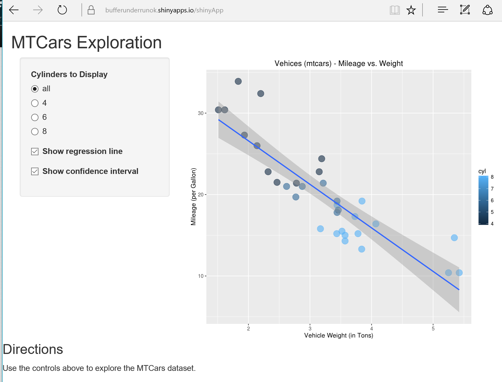

## Overview

MTCars comes from the *datasets* package.
- The data was extracted from the 1974 Motor Trend US magazine, and comprises fuel consumption and 10 aspects of automobile design and performance for 32 automobiles (1973–74 models).
- Seriously, it's very exciting.

--- class:span12

## What's in MTCars?

```{r, echo=FALSE}
summary(mtcars)
```

--- .class #id

## Usage

- https://bufferunderrunok.shinyapps.io/shinyApp/

- You can choose which set of cylinders to evlauate.
- You can choose to display a linear regression line.
- If you display the linear regression line, you can turn the confidence intervals on and off.

--- .class #id

## If it doesn't look like this, something is wrong.

<div>
    
</div>

--- &vcenter

## Thank you!

See you in the capstone!
